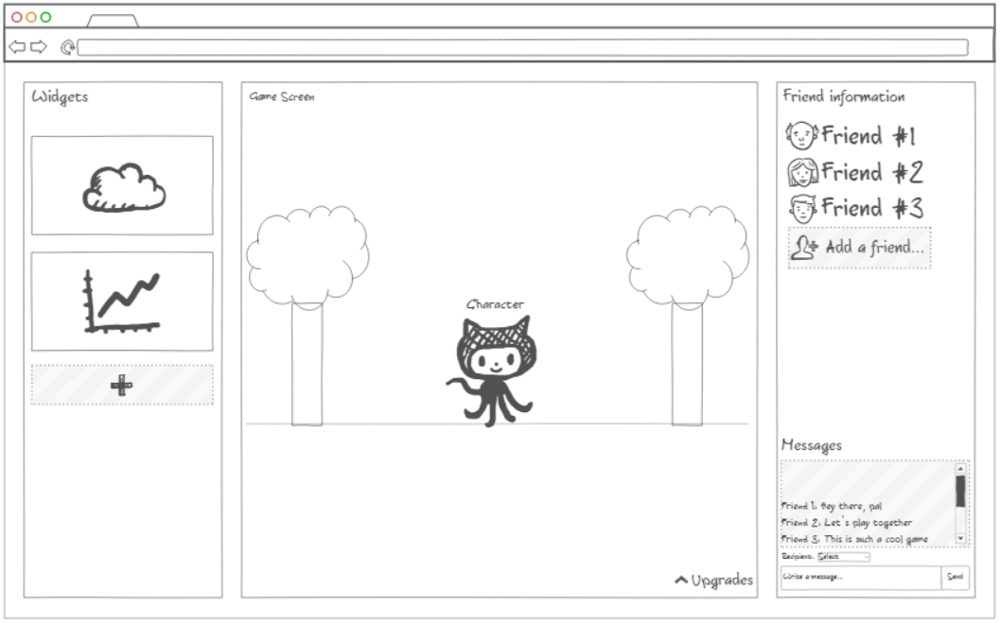

# Startup
For CS260
## Conflict Resolution
From this assignment, I learned that I can selectively manage the resolution between two differing commits to the same branch instead of needing to pick one over the other. I think that it is a very helpful feature of Github.
## Elevator Pitch
Pixel Pals is a digital companion game where you can customize your own virtual pet, and explore different places with it. The game allows players to customize their own virtual pet, and explore different places in a virtual world. The game's minimalist pixelated style is reminiscent of the classic Tamagotchi pets, but with a modern twist. Players can earn points through their pet's actions and use them to unlock new items and places for their pet. This allows for a sense of progression and achievement as players navigate the virtual world with their pet. Additionally, players can add friends and check in on their progress, and even message them. This adds a social element to the game, allowing players to compete and interact with their friends. Overall, Pixel Pals offers a unique and exciting experience that combines the nostalgia of virtual pets with the freedom and exploration of a virtual world.
### Mockup

### Features
* Basic **HTML** structure to group together elements
* **CSS** to add color and styling
* **JavaScript** to allow button functionality and interaction with the game
* **Web services** allow for storage and retrieval of progress information
* **Authentication** allows users to create and use profiles between sessions and devices
* **Database persistence** allows game progress ot be stored and loaded with each session
* **Web frameworks** allow modularization of pages into components and routing between them
* **WebSocket** allows for chatting with friends
* **PWA** allows for mobile porting of the site
* Players can create an account, customize a companion, and make progress by unlocking new features
* Players can also add friends via account info and message them, as well as see others' progress
* Widgets will pull from separate API's to provide information IRL while playing the game
## AWS
I learned how to create an AWS account, as well as a server instance, and how to assign it an elastic IP. (http://3.22.43.108)
## Route 53 Domain
This is the domain I registered: http://pixelpals.click
## HTTPS, TLS, and certificates
By getting a certificate, we are able to secure the connection.
## Simon HTML
I built the framework for the Simon game webpages, and now they need to be styled and made interactive. https://simon.pixelpals.click
I learned about how to format elements in placing them on separate or similar lines, and I also learned about being more consistent in my GitHub commits.
